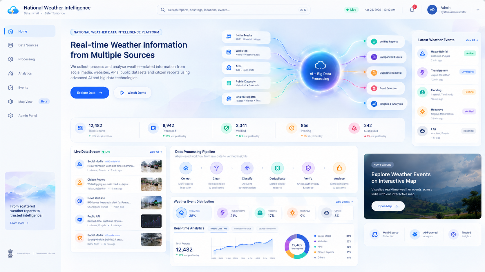

# 🪶 feather. — National Weather Intelligence & Ground Reality Analytics Platform

> **From fragmented weather information to verified national weather intelligence.**

**feather.** is an AI-powered national weather intelligence and big-data analytics platform designed to **collect, process, verify, deduplicate, and analyze** real-time weather-related information from multiple sources.

It creates an **intelligence layer between official weather information and real-world observations**, helping transform fragmented reports into **structured, explainable, and geospatially organized weather-event intelligence**.

---

## 📋 Table of Contents

- [Overview](#-overview)
- [Problem Statement](#-problem-statement)
- [Our Solution](#-our-solution)
- [Why feather.?](#-why-feather)
- [Core Idea](#-core-idea)
- [Key Features](#-key-features)
- [How feather. Works](#-how-feather-works)
- [Data Processing Pipeline](#-data-processing-pipeline)
- [Technology Stack](#-technology-stack)
- [Expected Impact](#-expected-impact)
- [Team](#-team)
- [Thank You](#-thank-you)

---

# 📌 Overview

Weather information in India is continuously generated from multiple sources:

- Official weather systems
- Public datasets
- Weather APIs
- Websites
- Public online sources
- Social media/public posts where permitted
- Citizen reports
- Images and videos

However, these sources are **fragmented, heterogeneous and available in different formats**.

A single weather event can generate hundreds of online reports, reposts, images and observations.

The challenge is not simply collecting more data.

The challenge is determining:

> **What happened, where did it happen, when did it happen, how many independent observations support it, and how reliable is the available evidence?**

This is where **feather.** comes in.

---
## 📌 Problem Statement

| **Field** | **Details** |
|---|---|
| **Problem Statement ID** | **26069** |
| **Problem Statement Title** | **National Weather Big Data Analytics Platform** |
| **Organization** | **Ministry of Earth Sciences (MoES)** |
| **Department** | **India Meteorological Department (IMD)** |
| **Domain** | **Weather / Big Data / AI & ML** |
| **Core Requirement** | Develop a scalable National Weather Big Data Analytics Platform for collecting, processing, storing and visualizing real-time weather-related information across India. |
| **Data Sources** | Social media platforms, public datasets, websites, APIs and citizen reports |
| **Data Collection** | Weather-related posts and information including `#IMD` and other relevant weather hashtags |
| **Metadata** | Date & time, city, state, GPS location, photos, videos and event category |
| **Processing** | Large-scale real-time data ingestion, processing, storage and visualization using big-data and open-source technologies |
| **AI / ML Requirements** | Identify fake or misleading reports, verify untrusted sources, remove duplicate entries and automatically categorize weather events |
| **Weather Events** | Rainfall, thunderstorms, flooding, heatwaves, fog, dust storms and strong winds |
| **Dashboard** | Web-based dashboard and Admin Panel for monitoring and analysis |
| **Required Filters** | Date-wise, event-wise, location-wise and verification-status filtering |
| **Visualization** | Real-time weather data visualization and analytics |

---

# 💡 Our Solution

## 🪶 feather. — National Weather Intelligence & Ground Reality Analytics

**feather.** converts fragmented weather information into a **unified, searchable, verifiable, and geospatially organized intelligence layer**.

The platform follows:

```text
COLLECT
   ↓
CLEAN
   ↓
EXTRACT
   ↓
LOCATE
   ↓
CLASSIFY
   ↓
VERIFY
   ↓
DEDUPLICATE
   ↓
CORROBORATE
   ↓
CLUSTER
   ↓
VISUALIZE
   ↓
ANALYZE
```
Instead of treating every online report as an independent event, **feather.** identifies relationships between reports and determines which observations actually provide **independent evidence**.


---

# 🎯 Why feather.?

Traditional weather systems primarily provide:

> **Official weather information**

Online platforms provide:

> **Large amounts of unstructured public information**

Citizen reporting provides:

> **Local observations**

But these sources do not automatically form a reliable intelligence layer.

**feather.** connects them through:

```text
Official Information
        +
Public Data
        +
Citizen Observations
        +
AI/ML
        +
Verification
        +
Geospatial Intelligence
        ↓
National Weather Intelligence
```
### The Key Idea

> **100 posts do not necessarily mean 100 independent observations.**

**feather.** attempts to distinguish:

```text
100 Online Reports
        ↓
88 Reposts / Duplicates
        ↓
12 Independent Observations
        ↓
1 Weather Event Cluster
```

---

# 🧠 Core Idea

**feather.** does not simply collect weather posts.

It transforms them into **event-level intelligence**.

### From:

```text
Post
Post
Post
Post
Post
Post
...
```
### To:

```text
Observation
      ↓
Evidence
      ↓
Verification
      ↓
Independent Observation
      ↓
Event Cluster
      ↓
National Weather Intelligence
```
The platform therefore creates a bridge between:

### 🌐 Official Weather Intelligence

and

### 📍 Real-World Observations

through:

**AI + Verification + Big Data + Geospatial Intelligence**

---

# 🚀 Key Features

## 1. 🌐 Multi-Source Data Collection

**feather.** collects weather-related information from multiple permitted sources and converts it into a common structured format.

### Sources Include:

- Public datasets
- Weather APIs
- Websites
- Public online sources
- Social media/public posts where permitted
- Citizen reports
- Images
- Videos
- Existing meteorological information

### Extracted Information Can Include:

- Date & time
- City & state
- GPS/location where available
- Text
- Images/videos
- Source
- Event category
- Report status

---

## 2. 🤖 AI Weather Event Detection

AI/ML models identify weather-related information and automatically classify it into relevant event categories.

### Supported Events:

- 🌧️ Heavy Rainfall
- 🌊 Flooding
- 💧 Waterlogging
- ⛈️ Thunderstorms
- 🌡️ Heatwaves
- 🌫️ Fog
- 🌪️ Dust Storms
- 💨 Strong Winds

### AI Capabilities:

- **Natural Language Processing** — identifies weather-related information from text.
- **Computer Vision** — analyzes relevant visual information from images and videos.
- **Multimodal Analysis** — combines available text and visual evidence.

---

## 🛡️ 3. AI-Assisted Verification

Not every online weather report should automatically be considered reliable.

**feather.** evaluates multiple signals before a report contributes to the verified intelligence layer.

### Verification Considers:

- Source reliability
- Time
- Location
- Content
- AI assessment
- Duplicate/reused content
- Supporting independent observations

### Verification Status:

```text
                INCOMING REPORT
                       ↓
                AI ASSESSMENT
                       ↓
              EVIDENCE CHECKING
                       ↓
        ┌──────────────┼──────────────┐
        ↓              ↓              ↓
     VERIFIED       SUSPICIOUS      REJECTED
```
Suspicious reports are not automatically treated as fake. Important decisions can remain subject to human verification.

---

## 🔎 4. Duplicate & Reused Content Detection

A single weather incident can generate hundreds of reposts.

If every repost is counted independently, the platform may incorrectly exaggerate the scale of an event.

**feather.** identifies duplicate and reused content to distinguish:

```text
100 Posts
   ↓
Duplicate Detection
   ↓
12 Independent Observations
+
88 Reposts / Duplicates
```
This prevents repeated content from being treated as separate evidence.

---

## 🧩 5. Weather Event Clustering

**feather.** groups related observations into common weather events.

Clustering considers:

- Location
- Time
- Event type
- Spatial proximity
- Temporal proximity
- Available evidence

### Example:

```text
45 Reports
     ↓
Same Region
     ↓
Similar Time Window
     ↓
Same Weather Phenomenon
     ↓
ONE WEATHER EVENT
```
This creates an **event-centric** representation instead of treating every post as a separate incident.

---

## 📍 6. Ground Reality Intelligence

The **Ground Reality layer** represents relevant local observations associated with detected weather events.

It complements official meteorological information rather than replacing it.

### Example:

```text
OFFICIAL INFORMATION

Heavy rainfall expected
in District X

          +

GROUND REALITY

Multiple independent reports
indicate active waterlogging

          ↓

WEATHER EVENT INTELLIGENCE
```
Ground Reality can include:

- Local observations
- Images
- Videos
- Location
- Time
- Verification status
- Related weather event
- Independent observations

---

## 🗺️ 7. National Weather Intelligence Dashboard

**feather.** provides a national dashboard for monitoring and analysing weather events in real time.

### Dashboard Includes:

- Active weather events
- Incoming reports
- Verified reports
- Pending reports
- Suspicious reports
- Rejected reports
- Event clusters
- Geographic distribution
- Recent updates
- Event trends

### Required Filters:

```text
Date
Event
Location
Verification Status
```
### National Event Map

The dashboard can visualize detected events across India, including:

- Rainfall
- Flooding
- Waterlogging
- Thunderstorms
- Heatwaves
- Fog
- Dust storms
- Strong winds

Analysts can select an event to view its location, status, supporting observations and available media.

---

## 🛠️ 8. Admin Verification & Monitoring Panel

The Admin Panel provides a dedicated workspace for reviewing and managing incoming weather reports.

### Administrators Can Inspect:

- Source
- Report time
- Location
- Event category
- Text
- Images/videos
- Verification status
- AI assessment
- Duplicate detection results
- Supporting observations

### Available Actions:

```text
REVIEW
  ↓
┌─────────────┬──────────────┬
↓             ↓              ↓
VERIFY     SUSPICIOUS      REJECT
```

---

# 🔄 How feather. Works

The complete system operates as an **event-intelligence pipeline**.

```text
              DATA SOURCES
                   │
                   ▼
             ┌───────────┐
             │  COLLECT  │
             └─────┬─────┘
                   ▼
             ┌───────────┐
             │  INGEST   │
             └─────┬─────┘
                   ▼
             ┌───────────┐
             │   CLEAN   │
             └─────┬─────┘
                   ▼
             ┌───────────┐
             │  EXTRACT  │
             └─────┬─────┘
                   ▼
             ┌───────────┐
             │ CLASSIFY  │
             └─────┬─────┘
                   ▼
             ┌───────────┐
             │  VERIFY   │
             └─────┬─────┘
                   ▼
             ┌───────────┐
             │DEDUPLICATE│
             └─────┬─────┘
                   ▼
             ┌───────────┐
             │CORROBORATE│
             └─────┬─────┘
                   ▼
             ┌───────────┐
             │  CLUSTER  │
             └─────┬─────┘
                   ▼
             ┌───────────┐
             │ VISUALIZE │
             └─────┬─────┘
                   ▼
             ┌───────────┐
             │  ANALYZE  │
             └───────────┘
```

---

# 🔄 Data Processing Pipeline
1. COLLECT

Collect weather-related information from multiple sources.

↓

2. INGEST

Bring information into a common processing pipeline.

↓

3. CLEAN

Remove malformed or irrelevant information.

↓

4. EXTRACT

Extract text, metadata, location, time and media.

↓

5. CLASSIFY

Identify the weather-event category.

↓

6. VERIFY

Perform AI-assisted verification with human review where required.

↓

7. DEDUPLICATE

Identify duplicate and reused content.

↓

8. CORROBORATE

Compare independent observations.

↓

9. CLUSTER

Group related observations into weather events.

↓

10. VISUALIZE

Display intelligence through the national map and dashboard.

↓

11. ANALYZE

Generate real-time and historical analytics.

---

## TECH STACK

| Layer | Technology |
|-------|------------|
| **Frontend** | React + TypeScript |
| **Backend / APIs** | Python FastAPI / Node.js |
| **Streaming** | Kafka / event-driven ingestion |
| **Big Data** | Spark / scalable batch processing |
| **AI / ML** | NLP • CV • similarity & classification |
| **Database** | PostgreSQL + PostGIS |
| **Search / Storage** | OpenSearch/Elasticsearch + object storage |
| **Maps** | GPS + Google Maps API (or open-source) |

---

## 🗺️ National Weather Intelligence Dashboard



---

# 🌍 Expected Impact

**feather.** can help provide:

- A unified national weather intelligence layer
- Faster identification of emerging weather events
- Better visibility of local observations
- Reduced impact of duplicate/reused reports
- Structured handling of potentially misleading information
- Geospatial visualization of weather events
- Better monitoring for administrators and analysts
- Historical weather-event intelligence
- More transparent evidence behind detected events

---

## Team

| S.No | Team Member | LinkedIn |
|---|---|---|
| 1 | **Sushant kumar Mishra** | [LinkedIn](https://www.linkedin.com/in/mishragisonline) |
| 2 | **Surbhi Sharma** | [LinkedIn](https://www.linkedin.com/in/surbhi-sharma-tech) |
| 3 | **Riya** | [LinkedIn](https://www.linkedin.com/in/riya-bansal-a1731a37a) |
| 4 | **vipul Sethi** | [LinkedIn](https://www.linkedin.com/in/vipul-sethi-b1508937a) |
| 5 | **Neeraj Kumar** | [LinkedIn]([www.linkedin.com/in/neerajkumarlearner](https://www.linkedin.com/in/neerajkumarlearner/?lipi=urn%3Ali%3Apage%3Ad_flagship3_profile_view_base_contact_details%3B1lAwVieSTJKhc8eyVmmWMQ%3D%3D)) |
| 6 | **Sharanpreet Kaur** | [LinkedIn](https://www.linkedin.com/in/sharanpreet-kaur-1a00a037a) |

---

# Thank You

Thank you for exploring **feather. — National Weather Intelligence & Ground Reality Analytics Platform**.

### Smart India Hackathon 2026 · PS 26069

> **From fragmented weather information to verified national weather intelligence.**

---
